# manual-linux

***Primeiro passo***
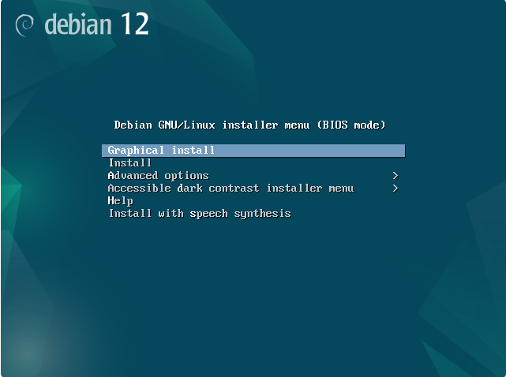

***Segundo passo***
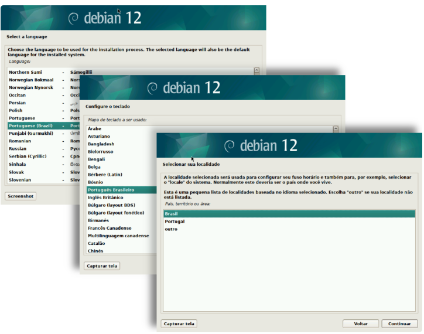

***Terceiro passo***
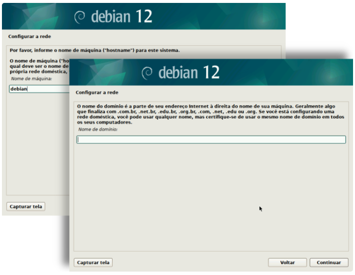

***Quarto passo***
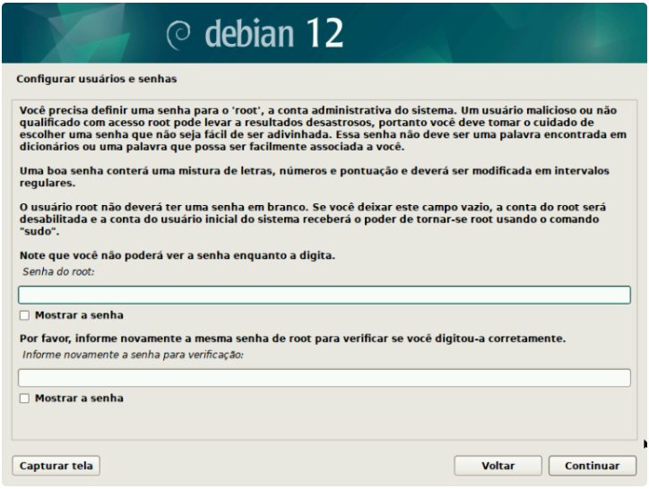

***Quinto passo***
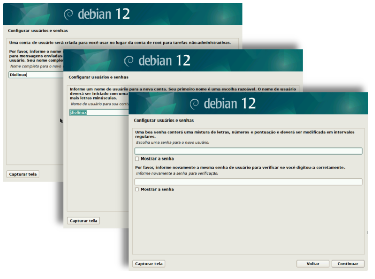

***Sexto passo***
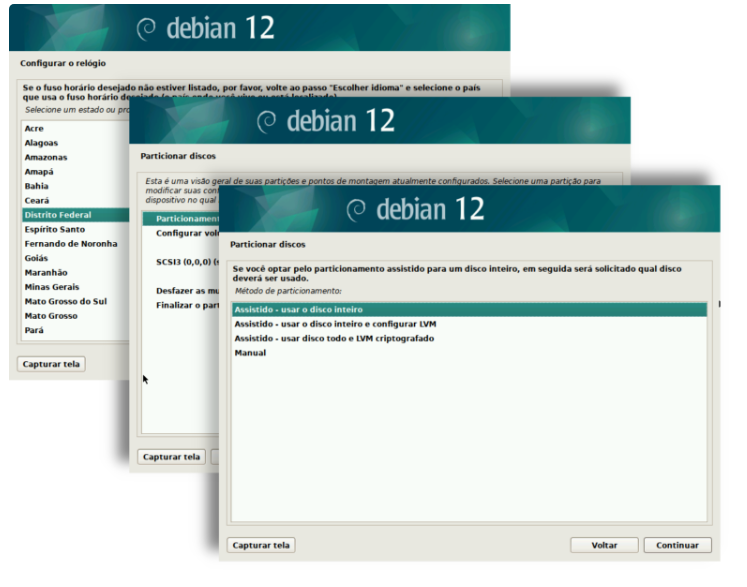

***Sétimo passo**
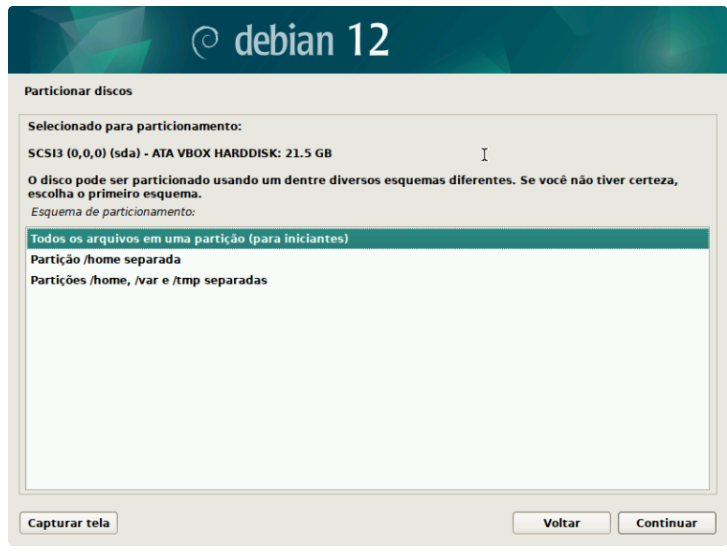

***Oitavo passo***
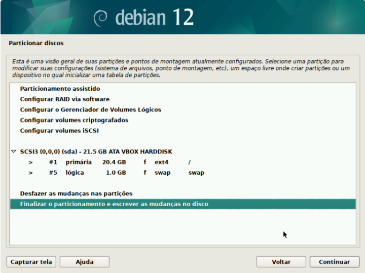

***Nono passo***
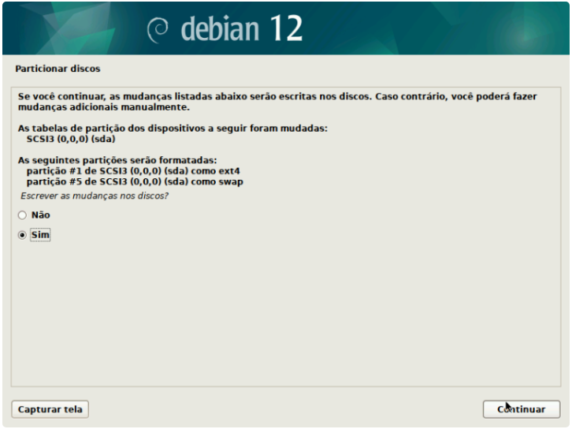

***Décimo passo***
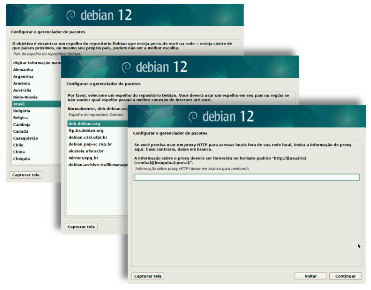

***Décimo primeiro passo***
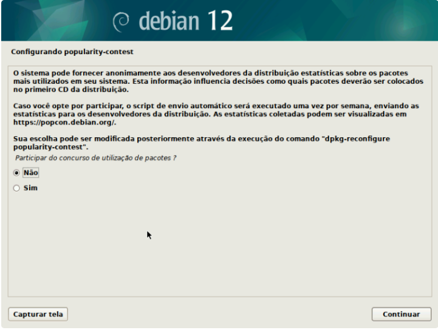

***Décimo segundo passo***
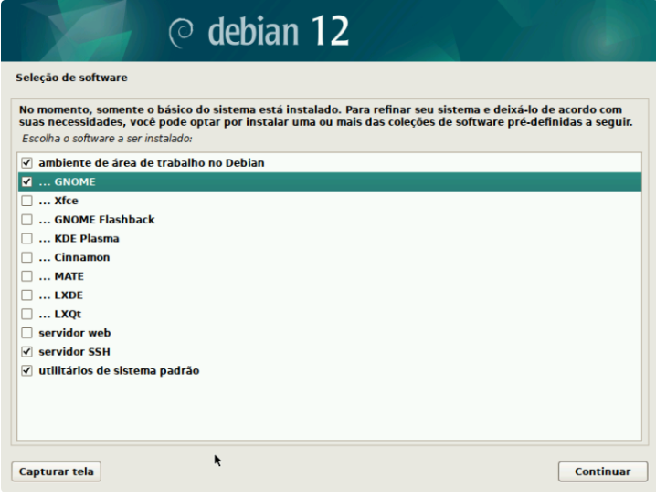

***Décimo terceiro passo***
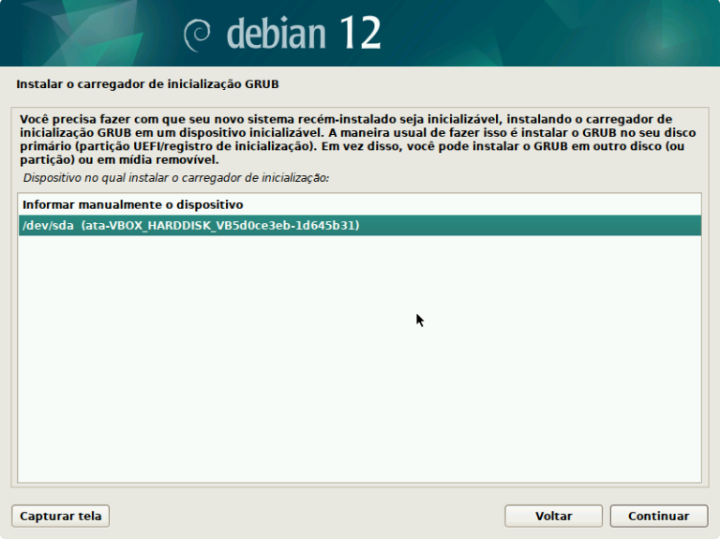

***Décimo quarto passo***
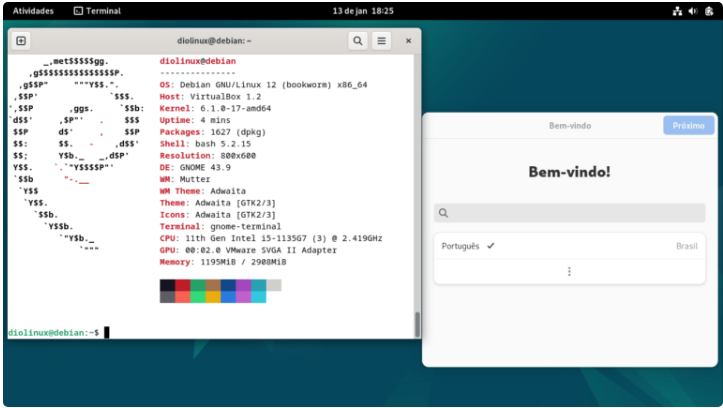

